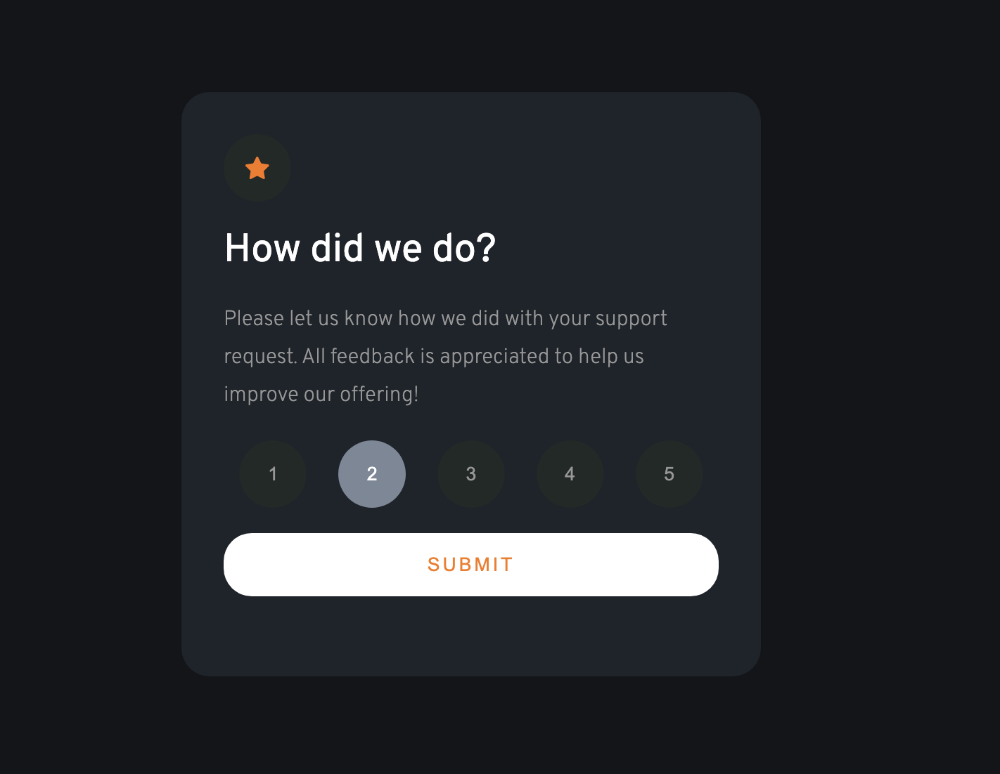

# Frontend Mentor - Interactive rating component solution

This is my solution to the [Interactive rating component challenge on Frontend Mentor](https://www.frontendmentor.io/challenges/interactive-rating-component-koxpeBUmI). Frontend Mentor challenges help you improve your coding skills by building realistic projects.

## Overview

### The challenge

Users should be able to:

- View the optimal layout for the app depending on their device's screen size
- See hover states for all interactive elements on the page
- Select and submit a number rating
- See the "Thank you" card state after submitting a rating

### Screenshot



### Links

- Solution URL: [https://github.com/hollyBelly2021/interactive-rating-component-main](https://github.com/hollyBelly2021/interactive-rating-component-main)
- Live Site URL: [https://hollybelly2021.github.io/interactive-rating-component-main/](https://your-live-site-url.com)

## My process

### Built with

- Semantic HTML5 markup
- CSS custom properties
- Flexbox
- [jQuery](https://jquery.com/) - JS library

### What I learned

1.  Using focus

```css
.icon-circle:focus {
  background-color: #7c8798;
  color: white;
}
```

2. jQuery

```js
$(".icon-circle").on("click", function () {
  submitRating(this.innerHTML);
});
```

- Query select `.icon-circle` and add an `addEventListener("click", function(){})` Then pass in `this.innerHTML` or text content to function `submitRating(rating)`

```js
function submitRating(rating) {
  $(".button").on("click", function () {
    $(".rating-container").html(
      `<section class="greeting-container">
    
    <div class="long-bubble">You selected ${rating} out of 5</div>
    <div class="greeting-desc">
      <h1>Thank you!</h1>
      <p class="text">
        We appreciate you taking the time to give a rating. If you ever
        need more support, don’t hesitate to get in touch!
      </p>
    </div>
  </section>`
    );
  });
}
```

- Query select `.button` and add an `addEventListener("click", function(){})`
- Inside the function, query select `.rating-container` and change the html inside.

## Author

- LinkedIn - [Maea Matugas](www.linkedin.com/in/maea-matugas)
- Frontend Mentor - [@hollyBelly2021](https://www.frontendmentor.io/profile/hollyBelly2021)
- GitHub - [@hollyBelly2021](https://github.com/hollyBelly2021)

## Acknowledgments

I acknowledge the original author of this challenge.
